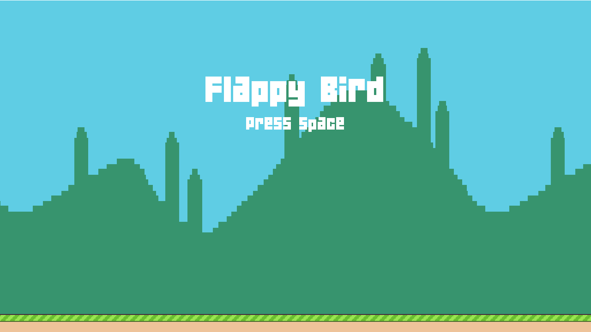
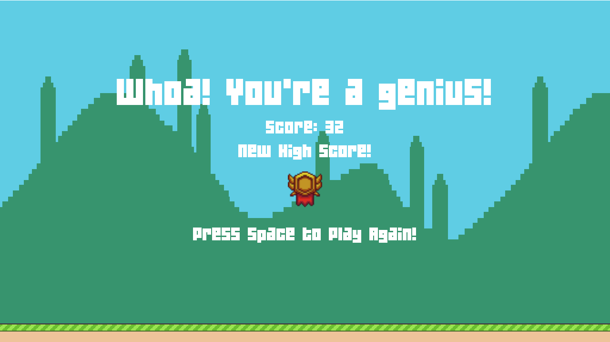

# Flappy Bird


[](../../../releases?q=flappybird&expanded=true)

A LÖVE2D (Lua) implementation of Flappy Bird inspired by Lecture 1 of CS50's Introduction to Game Development (CS50 2D) — flap through procedurally spawned pipes as the pace ramps up with your score.


## Running it

```
love .
```
from inside the `1-FlappyBird/` folder.

Or grab a packaged build (Windows `.exe`, Android `.apk` when available) from the [Flappy Bird releases page](../../../releases?q=flappybird&expanded=true) — no LÖVE installation needed.

## Controls

| Action | Key |
|---|---|
| Flap / Start / Restart | `Space` or Left Click |
| Pause | `P` |
| Resume (after pause) | `P` |
| Quit | `Escape` |

## Features

Beyond base Flappy Bird, this version adds:

- **Flap-triggered sprite animation** — the wing-flap animation plays only on jump input and resets its timer on each flap, rather than animating continuously.
- **Score-scaling difficulty** — pipe spawn interval shrinks as the score climbs (down to a floor set by pipe width and speed), so the pace ramps up progressively over a run instead of spawning at one fixed random interval.
- **Countdown-driven pause/resume** — pressing `P` pauses the run; pressing it again re-triggers the same 3-2-1 countdown used at round start, sharing one `Countdown()` function instead of resuming instantly.


## Screenshots

| Title screen | Score screen |
|---|---|
|  |  |

## Structure

```
1-FlappyBird/
├── conf.lua
├── main.lua
├── src/
│   ├── Bird.lua
│   ├── Pipe.lua
│   ├── PipePair.lua
│   ├── Save.lua
│   ├── StateMachine.lua
│   └── states/
│       ├── BaseState.lua
│       ├── TitleScreenState.lua
│       ├── CountdownState.lua
│       ├── PlayState.lua
│       └── ScoreState.lua
├── libs/        # class.lua, push.lua
└── assets/
    ├── fonts/   # flappy.ttf, font.ttf
    ├── images/  # background, bird, pipe, ground, medals
    └── sounds/  # music, jump, score, hurt, explosion, pause, countdown
```