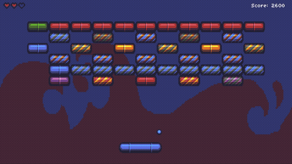
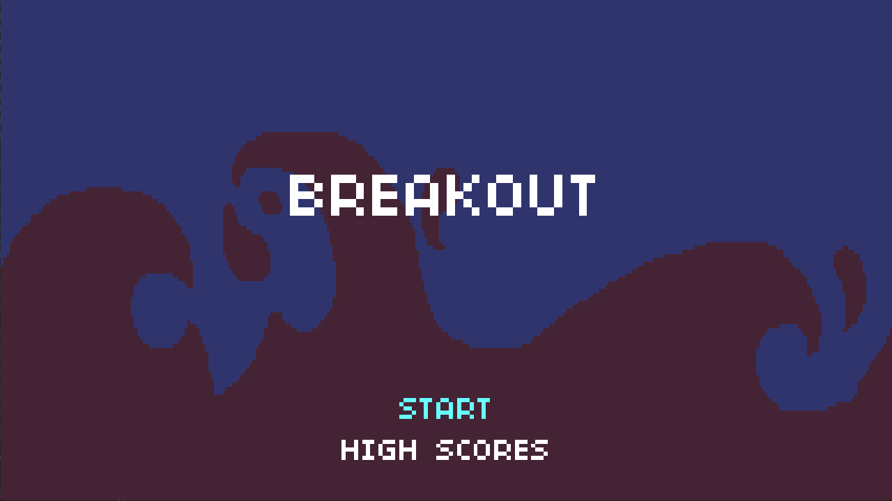
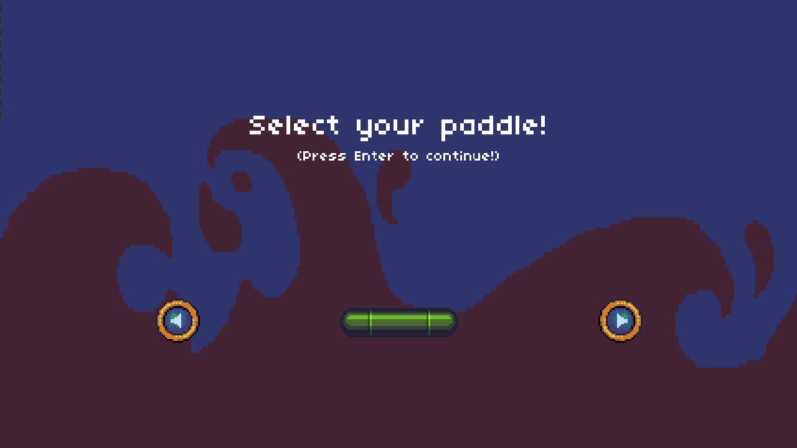
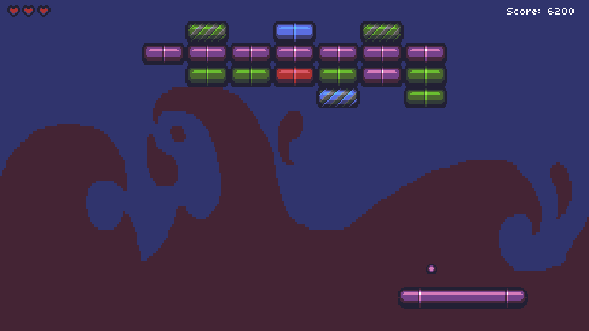
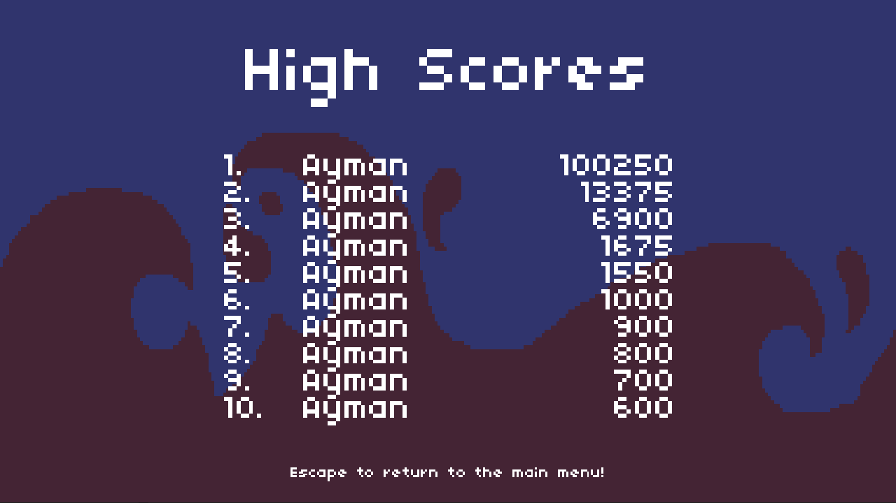

# Breakout


[](../../../releases?q=breakout&expanded=true)

A LÖVE2D (Lua) implementation of Breakout, inspired by Lecture 2 of CS50's Introduction to Game Development (CS50 2D) — clear procedurally generated levels, chase power-ups, and pick up right where you left off with saved progress.



## Running it

```
love .
```
from inside the `2-Breakout/` folder.

Or grab a packaged build (Windows `.exe`, Android `.apk` when available) from the [Breakout releases page](../../../releases?q=breakout&expanded=true) — no LÖVE installation needed.

## Controls

**Desktop**

| Action | Key |
|---|---|
| Move paddle | `←`/`→` or `A`/`D` |
| Change paddle skin (select screen) | `←`/`→` or `A`/`D` |
| Confirm / Serve / Continue | `Enter`, `Space`, or Left Click |
| Pause | `P` or `Escape` |
| Resume (while paused) | `P` or `Space` |
| Quit to main menu (while paused) | `Escape` |
| Enter high-score name | Type letters, `Backspace` to delete, `Enter` to confirm |
| Quit | `Escape` (Start screen / Game Over) |

**Mobile**

| Action | Touch |
|---|---|
| Move paddle | Drag — speed scales with distance from the paddle's center, not a raw 1:1 follow |
| Select a menu option | Tap it |
| Serve / Continue | Tap anywhere |
| Enter high-score name | Native on-screen keyboard opens automatically |

## Features

Beyond base Breakout, this version adds:

- **Mobile support** — touch-drag paddle control, tap-based menu navigation, and the OS on-screen keyboard triggered for high-score name entry.
- **Persistent level progress** — not only saves score, but also `level.dat` stores the current level and remaining hearts after every level clear, and resets to level 1 on game over, so closing the game mid-run doesn't cost you cleared levels.
- **All ten power-ups** — every power-up in the sprite atlas is implemented through a `POWER_UPS` enum and an `EFFECTS` dispatch table: paddle and ball resize, extra/lost heart, faster/slower paddle, extra balls, and a key.
- **Locked bricks** — bricks flagged `isLocked` absorb hits without scoring until a `KEY` power-up (guaranteed to drop once a locked brick exists) is collected, which unlocks every locked brick on the level at once.
- **Multi-ball** — `PlayState` tracks balls as an array rather than a single reference, so movement, collisions, and loss checks all scale naturally when the extra-balls power-up fires.
- **Free-text high-score names** — driven by `love.textinput`, up to 7 alphabetic characters, rather than fixed three-letter entry.

## Screenshots

| Start screen | Paddle select |
|---|---|
|  |  |

| In-game | High scores |
|---|---|
|  |  |

## Structure

```
2-Breakout/
├── main.lua
├── src/
│   ├── Ball.lua
│   ├── Brick.lua
│   ├── LevelMaker.lua
│   ├── Paddle.lua
│   ├── PowerUp.lua
│   ├── StateMachine.lua
│   ├── dependencies.lua
│   ├── util.lua
│   └── states/
│       ├── BaseState.lua
│       ├── StartState.lua
│       ├── PaddleSelectState.lua
│       ├── ServeState.lua
│       ├── PlayState.lua
│       ├── VictoryState.lua
│       ├── GameOverState.lua
│       ├── HighScoreState.lua
│       └── EnterHighScoreState.lua
├── libs/        # class.lua, push.lua
└── assets/
    ├── font.ttf
    ├── images/  
    └── sounds/  
```