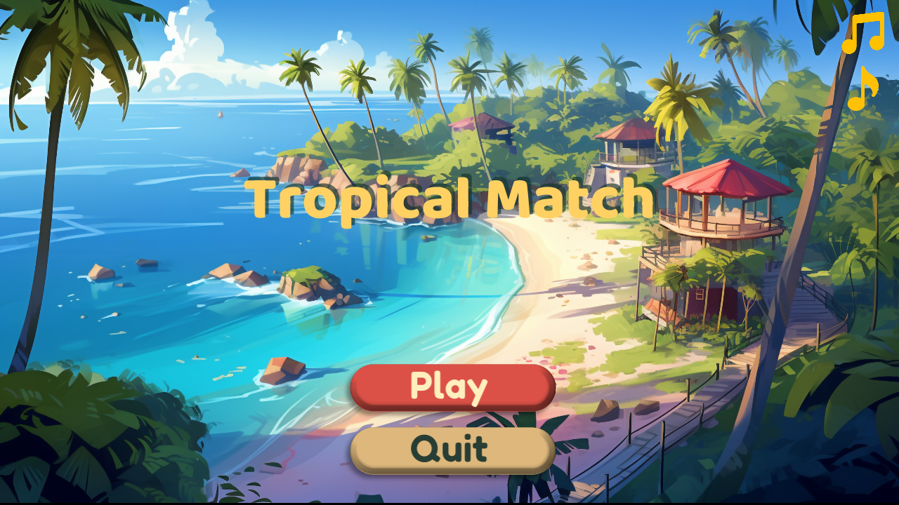
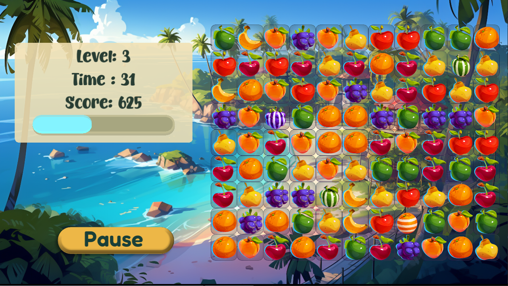
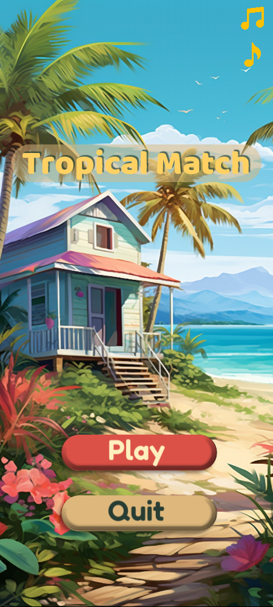
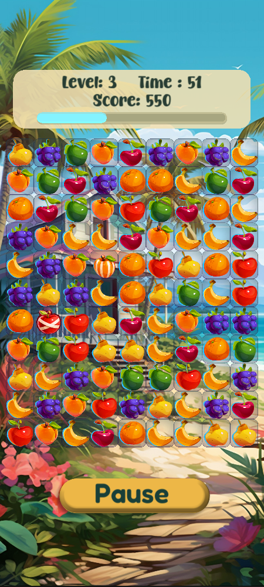

# Match 3


[](../../../releases?q=match-3&expanded=true)

A LÖVE2D (Lua) implementation of Match 3, inspired by Lecture 3 of CS50's Introduction to Game Development (CS50 2D) and branded in-game as **Tropical Match** — chain fruit matches, chase SuperFruit combos, and beat the clock across escalating levels on desktop or Android.


## Running it

```
love .
```
from inside the `3-Match-3/` folder.

Or grab a packaged build (Windows `.exe`, Android `.apk` when available) from the [Match 3 releases page](../../../releases?q=match-3&expanded=true) — no LÖVE installation needed.

## Controls

| Action | Input |
|---|---|
| Select a tile (tap-to-swap) | Click/tap a tile, then click/tap an adjacent tile |
| Swap by dragging | Click-drag or touch-drag a tile toward a neighbor |
| Pause | Click/tap the pause button |
| Resume (while paused) | Click/tap **Resume** |
| Restart (while paused) | Click/tap **Restart** |
| Quit to main menu (while paused) | Click/tap **Quit** |
| Toggle music / sound effects | Click/tap the music / SFX icon |

Desktop and mobile share the exact same swap logic.

## Features

Beyond base Match 3, this version adds:

- **Illustrated art style** — background, fruit, and tile art with linear texture filtering, replacing the pixel art and nearest-neighbor filtering for a modern look.
- **SuperFruits with unique effects and combos** — a match of 4 spawns a striped SuperFruit (clears its column if made horizontally, its row if made vertically), an intersecting match spawns a 3×3-blast SuperFruit, and a match of 5 spawns a rainbow fruit. Swapping two SuperFruits together chains their effects: two stripes cross-clear a full row and column, a stripe plus a 3×3 clears a wider band in both directions, two 3×3s clear a 5×5 area, and a rainbow paired with any SuperFruit turns every tile of the matched color into that SuperFruit before detonating them all at once — two rainbows together clear the entire board.
- **Tap or drag input** — tiles can be swapped either by tapping/clicking one tile then an adjacent one, or by dragging in the direction of the swap, with a distance threshold to tell a tap from a drag. On desktop, the cursor swaps to a custom grab icon once a drag crosses that threshold.
- **Portrait mobile layout via a dedicated `Layout` module** — `Layout.lua` builds every screen's positions and sizes once in `love.load` as plain data tables, switching between a 512×288 desktop layout and a 360×800 mobile portrait layout based on the detected platform; states reference the prebuilt layout instead of computing their own coordinates, and fonts are rebaked and `push` re-synced on `love.resize` to handle Android's asynchronous window resizing.
- **Escalating levels with reshuffling** — each level raises the score goal and shrinks the timer, the board automatically reshuffles if no valid moves remain, and the best accumulated score persists across sessions via `progress.sav`.

## Screenshots

**Desktop (landscape)**

| Start screen | In-game |
|---|---|
|  |  |

**Mobile (portrait)**

| Start screen | In-game |
|---|---|
|  |  |

## Structure

```
3-Match-3/
├── main.lua
├── src/
│   ├── Board.lua
│   ├── Button.lua
│   ├── Fruit.lua
│   ├── SuperFruit.lua
│   ├── Layout.lua
│   ├── Save.lua
│   ├── StateMachine.lua
│   ├── Transition.lua
│   ├── dependencies.lua
│   ├── util.lua
│   └── states/
│       ├── BaseState.lua
│       ├── StartState.lua
│       ├── BeginLevelState.lua
│       ├── PlayState.lua
│       └── GameOverState.lua
├── libs/        # class.lua, knife-timer.lua, push.lua
└── assets/
    ├── cursors/ # basic.png, grab.png
    ├── fonts/   # Baloo.ttf, Butterpop.otf, Fredoka.ttf
    ├── images/  # backgrounds, button, fruits, particles, sfx icons, super-fruits, tile
    └── sounds/  # music, match, error, clock, next-level, game-over, select
```