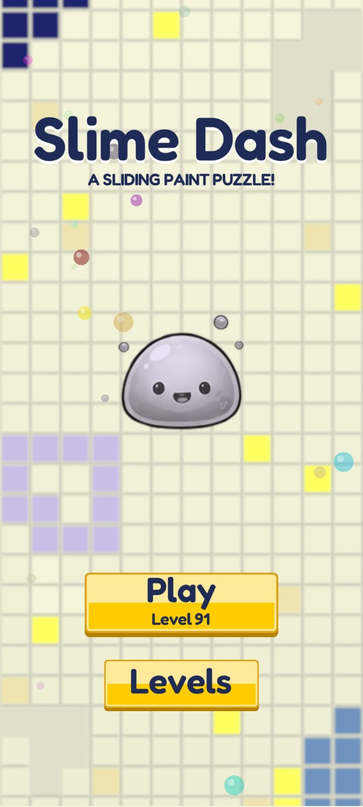
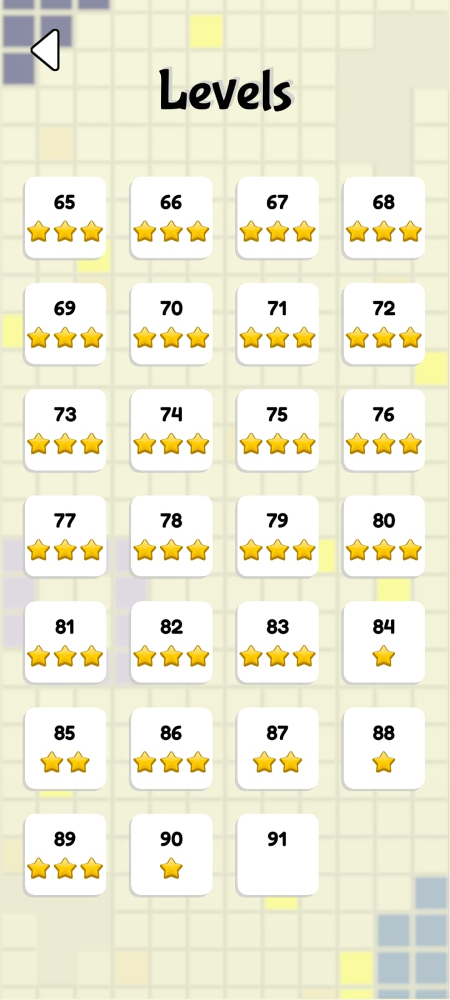
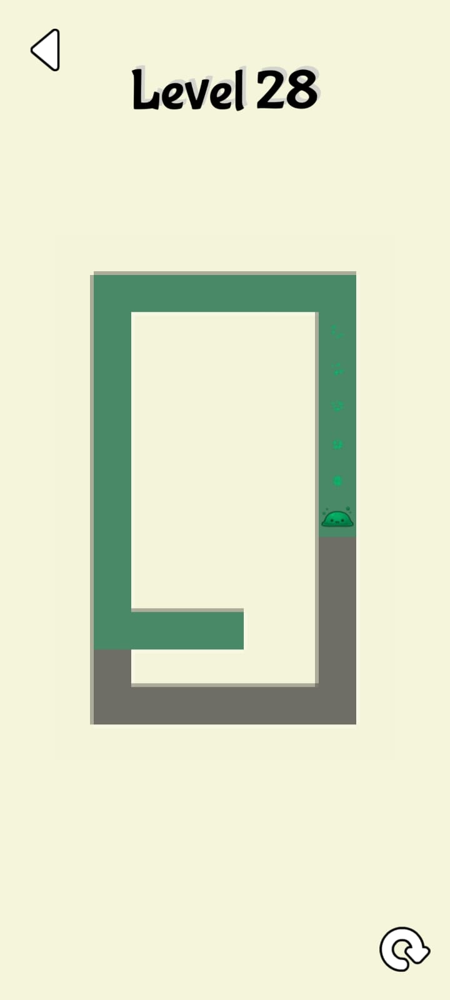
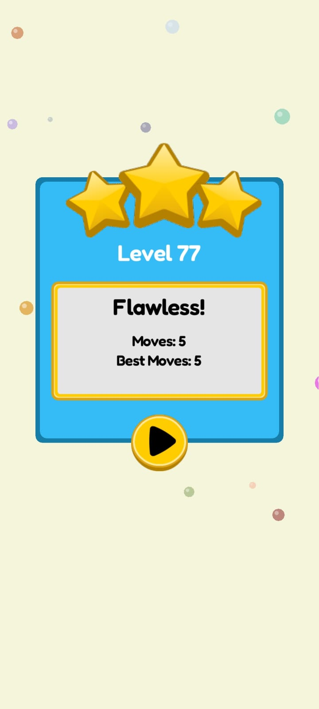

# Slime Dash


[](../../../releases?q=slime-dash&expanded=true)

A LÖVE2D (Lua) mobile puzzle game: swipe the slime across the grid and it glides until it hits a wall, painting every tile it crosses. Clear the whole board to win. Built for mobile.


## Running it

grab a packaged APK from the [Slime Dash releases page](../../../releases?q=slime-dash&expanded=true) and install it on your Android device.
You can also zip the contents of the Slime Dash/ folder into a .love file and open it with the [LÖVE Android app](https://github.com/love2d/love/releases/download/11.5/love-11.5-android.apk).

On PC, you can run:

```
love .
```

from inside the `Slime Dash/` folder — good for checking layout and animations, but there's no mouse input, so menus and swipes won't respond.

## Controls

| Action | Input |
|---|---|
| Move the slime | Swipe up / down / left / right anywhere on the board — it glides until it hits a wall, painting every tile it crosses |
| Queue a move | Swipe again while the slime is still gliding (up to 3 swipes queue up) |
| Retry the level | Tap the retry icon |
| Back to the main menu | Tap the back icon |
| Play | Tap **Play** on the main menu to jump into the next unlocked level |
| Browse levels | Tap **Levels** on the main menu, then tap any unlocked tile to jump to it, or drag to scroll |

## Features

- **Solvability-by-construction level generation** — Levels are procedurally generated using a seeded maze-carving algorithm, ensuring every corridor is reachable. Each level always has the same layout, and a flood-fill check verifies it before it's used.
- **Swipe-and-glide movement with move queueing** — a swipe sends the slime sliding until it hits a wall; up to three queued swipes chain moves without waiting for the current glide to finish.
- **Star rating tied to clean runs** — a flawless first try earns three stars; restarting mid-level caps the rating. Stars and best move counts are saved per level and never downgrade on replay.
- **Hand-rolled visuals** — particle bursts on paint, a drifting ambient bubble background with no texture assets, and bevelled tiles rendered from wall-adjacency data.
- **Custom touch input layer** — frame-local press/release queues plus persistent per-touch state, built for a portrait canvas.


## Level generation

Each level is carved with a randomized-Prim's-style algorithm seeded deterministically from the level number: BFS finds every tile currently reachable by a legal glide from the carving "head," a random open direction is picked from that frontier, and the algorithm slides and carves along it exactly the way the slime would during play, while reserving the wall just past where it stops so that corridor keeps its intended stopping point. Because carving *is* movement, solvability falls out of the construction instead of needing to be checked afterward; a flood-fill verification pass still runs as a safety net, retrying with a new seed if a layout ever fails it.

## Screenshots

| Start screen | Level select |
|---|---|
|  |  |

| Gameplay | Level complete |
|---|---|
|  |  |

## Structure

```
Slime Dash/
├── main.lua
├── src/
│   ├── Bubble.lua
│   ├── Button.lua
│   ├── LevelMaker.lua
│   ├── Save.lua
│   ├── Slime.lua
│   ├── StateMachine.lua
│   ├── Tile.lua
│   ├── dependencies.lua
│   ├── util.lua
│   └── states/
│       ├── BaseState.lua
│       ├── StartState.lua
│       ├── PlayState.lua
│       ├── LevelSelectState.lua
│       └── LevelCompleteState.lua
├── libs/        # class.lua, knife-timer.lua, push.lua
└── assets/
    ├── fonts/   # BubblegumSans.ttf, Fredoka.ttf
    ├── images/  # background, buttons, logo, particle, slime spritesheet, stars
    └── sounds/  # music, hit, pop, select, star
```
